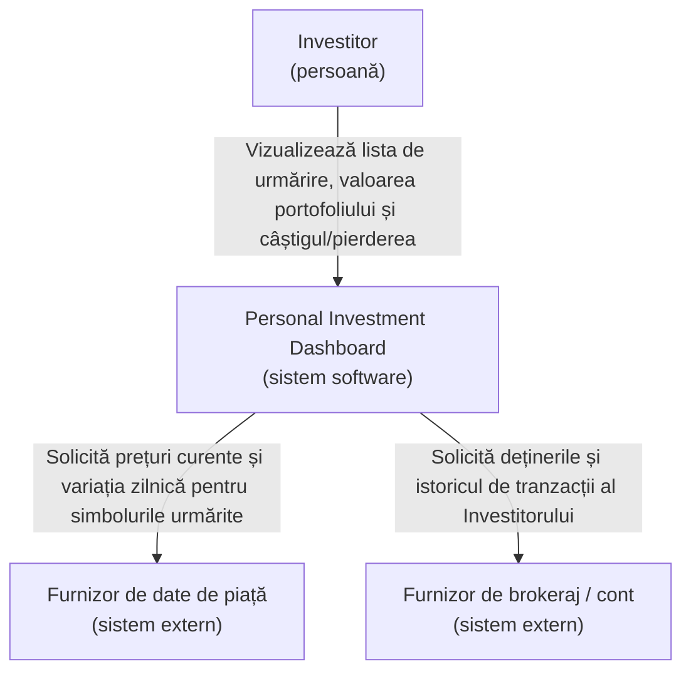

# Lab 1: Definirea Produsului Inițial — Personal Investment Dashboard

## 1. Cercetare de produs

**Întrebarea de cercetare:** Cum ajută produsele existente un User să urmărească informații de piață, și ce părți ar trebui incluse în prima versiune a acestui Dashboard?

Am analizat un produs de tip market-data (**Yahoo Finance**) și un produs de tip trading (**Interactive Brokers**).

| Produs | Utilizator probabil și scop | Pattern reutilizabil |
|---|---|---|
| Yahoo Finance | Un investitor ocazional care vrea să verifice prețurile curente, mișcarea indicilor și știri despre acțiuni/fonduri care îl interesează, fără să plaseze tranzacții. | O **listă de urmărire (watchlist)** cu simboluri alese, care arată prețul live, variația zilnică (%), și un mic grafic de preț; valoare totală de portofoliu dacă utilizatorul adaugă manual deținerile. |
| Interactive Brokers | Un investitor/trader activ care deține deja poziții și vrea să vadă valoarea reală a portofoliului, câștigurile/pierderile, și să execute tranzacții. | O **vedere de poziții/portofoliu** care arată cantitatea deținută, costul mediu, valoarea curentă și câștigul/pierderea nerealizată pentru fiecare deținere, plus soldul total la nivel de cont. |

**Cum a influențat asta scopul:** Yahoo Finance arată că o listă de urmărire simplă cu preț + variație zilnică este experiența de bază pentru "urmărirea pieței" și nu necesită cont. Interactive Brokers arată că investitorii vor să vadă și performanța *propriilor* deținerilor (câștig/pierdere, valoare totală), nu doar prețurile brute de piață — dar plasarea de tranzacții este o preocupare mult mai mare, separată. Asta a confirmat decizia de scop: **prima versiune trebuie să permită unui User să urmărească o listă de simboluri și performanța propriilor deținerilor, dar nu trebuie să permită plasarea de tranzacții** (asta aparține unui produs de trading, nu acestui Dashboard).

## 2. Stakeholderi și actori

| Stakeholder | Motivație | Influență | Motiv |
|---|---|---|---|
| Investitorul individual (User final) | Ridicată | Ridicată | Folosește produsul zilnic pentru a lua decizii financiare personale; dacă produsul nu îl servește, produsul eșuează. |
| Furnizorul de date de piață | Scăzută | Ridicată | Nu îi pasă de acest produs specific, dar Dashboard-ul depinde complet de el pentru prețuri; dacă își schimbă API-ul/termenii, Dashboard-ul trebuie să se adapteze. |
| Furnizorul de brokeraj/cont | Scăzută | Ridicată | Deține înregistrarea reală a deținerilor User-ului; Dashboard-ul depinde total de acuratețea și disponibilitatea acestor date. |
| Product Owner (echipa care construiește Dashboard-ul) | Ridicată | Ridicată | Decide direct scopul, prioritățile și ce se lansează. |
| Autoritatea de reglementare financiară | Scăzută | Scăzută (direct) | Nu interacționează direct cu Dashboard-ul, dar reguli privind afișarea datelor financiare / disclaimere ar putea constrânge produsul. |
| Echipa de suport pentru clienți | Medie | Scăzută | Vrea ca produsul să fie suficient de simplu încât să reducă numărul de tichete de suport, dar nu controlează deciziile de produs. |

**Matricea Motivație / Influență**

| Motivație | Influență scăzută | Influență ridicată |
|---|---|---|
| **Ridicată** | Echipa de suport pentru clienți | Investitorul individual, Product Owner |
| **Scăzută** | Autoritatea de reglementare | Furnizorul de date de piață, Furnizorul de brokeraj/cont |

**Clasificare (stakeholder vs. actor vs. sistem extern):**

- **Actor uman direct:** Investitorul individual — se autentifică și folosește direct Dashboard-ul.
- **Sistem extern:** Furnizorul de date de piață — furnizează prețuri/cotații direct către Dashboard.
- **Sistem extern:** Furnizorul de brokeraj/cont — furnizează deținerile/tranzacțiile reale ale User-ului direct către Dashboard.
- **Doar stakeholder (nu apare în vederea C4):** Product Owner, Autoritatea de reglementare, Echipa de suport — influențează sau sunt afectați de produs, dar nu interacționează direct cu sistemul în funcțiune.

## 3. Promisiunea produsului și scopul

> **Personal Investment Dashboard** ajută **investitorii individuali** să rezolve **problema urmăririi prețurilor de piață și a propriilor deținerilor din surse multiple și deconectate**, astfel încât **să poată vedea o imagine clară și actualizată a investițiilor lor și să ia decizii informate**.

**Cinci obiective (goals)** (fiecare este un rezultat vizibil pentru User):

1. Un User poate vedea prețul curent și variația zilnică pentru orice simbol de piață pe care alege să îl urmărească.
2. Un User poate vedea valoarea totală curentă a propriilor deținerilor, actualizată cu prețurile curente de piață.
3. Un User poate vedea câștigul sau pierderea (în valoare și %) pentru fiecare deținere de la achiziționare.
4. Un User este informat clar când un preț sau o valoare de deținere este învechită sau indisponibilă, în loc să vadă cifre greșite fără avertisment.
5. Un User poate căuta și adăuga un simbol nou în lista de urmărire în câteva secunde.

**Trei non-obiective (non-goals)** (eliminate din prima versiune):

1. Plasarea, modificarea sau anularea de tranzacții de orice fel.
2. Raportare fiscală sau generarea de documente fiscale oficiale.
3. Sfaturi de investiții personalizate sau recomandări automate (ex: sugestii de "cumpără/vinde").

## 4. Cerințe funcționale

### DASH-1
**Scopul actorului:** Investitorul trebuie să vadă cum evoluează astăzi un simbol de piață care îl interesează.
**User story:** În calitate de Investitor, vreau să adaug un simbol în lista mea de urmărire și să văd prețul curent și variația zilnică, astfel încât să pot verifica rapid cum evoluează.
**Definiții de finalizare (definitions of done):**
- Simbolul apare în lista de urmărire cu prețul curent și variația zilnică (%) afișate.
- Dacă simbolul nu există sau nu poate fi găsit, Investitorul vede un mesaj clar "nu a fost găsit", nu un rezultat gol.
- Lista de urmărire suportă cel puțin 20 de simboluri per Investitor.

### DASH-2
**Scopul actorului:** Investitorul trebuie să știe valoarea totală curentă a tot ce deține.
**User story:** În calitate de Investitor, vreau să văd valoarea totală curentă a deținerilor mele, astfel încât să știu cum evoluează portofoliul meu în ansamblu chiar acum.
**Definiții de finalizare:**
- Dashboard-ul afișează o valoare totală de portofoliu, calculată din prețurile curente.
- Dacă prețul curent al unei dețineri nu este disponibil, totalul este afișat cu o notă vizibilă că este incomplet, în loc să fie exclus fără avertisment.
- Totalul se actualizează de fiecare dată când Investitorul deschide Dashboard-ul.

### DASH-3
**Scopul actorului:** Investitorul trebuie să știe dacă o anumită deținere aduce câștig sau pierdere.
**User story:** În calitate de Investitor, vreau să văd câștigul sau pierderea pentru fiecare deținere de când am cumpărat-o, astfel încât să pot decide dacă păstrez sau reconsider acea investiție.
**Definiții de finalizare:**
- Fiecare deținere afișează câștigul/pierderea atât în sumă, cât și în procent.
- Dacă prețul original de achiziție lipsește, deținerea afișează "cost de bază indisponibil" în loc de un câștig/pierdere fals sau zero.
- Câștigurile sunt distinse vizual de pierderi (de exemplu, o prezentare clar diferită, nu doar culoare).

### DASH-4
**Scopul actorului:** Investitorul trebuie să aibă încredere că numerele afișate sunt actuale.
**User story:** În calitate de Investitor, vreau să fiu informat când datele afișate sunt învechite sau lipsesc, astfel încât să nu iau decizii pe baza unor informații depășite.
**Definiții de finalizare:**
- Fiecare preț sau valoare afișează ora ultimei actualizări.
- Dacă datele sunt mai vechi decât o limită de prospețime definită, Dashboard-ul le marchează vizibil ca "învechite", nu le prezintă ca fiind live.
- Dacă o sursă de date este complet inaccesibilă, secțiunea afectată arată o stare explicită "indisponibil", nu un ecran gol sau înșelător.

### DASH-5
**Scopul actorului:** Investitorul trebuie să poată adăuga sau elimina un simbol din ce urmărește.
**User story:** În calitate de Investitor, vreau să caut și să adaug un simbol nou în lista mea de urmărire, sau să elimin unul care nu mă mai interesează, astfel încât Dashboard-ul meu să arate doar ce este relevant pentru mine.
**Definiții de finalizare:**
- O căutare returnează simbolurile potrivite în câteva secunde pentru o interogare validă.
- Adăugarea unui simbol deja urmărit nu creează o intrare duplicat.
- Eliminarea unui simbol îl scoate imediat din vederea listei de urmărire.

*(Împreună, DASH-1 până la DASH-5 acoperă: urmărirea simbolurilor de piață, vizualizarea valorii totale, vizualizarea performanței per deținere, încrederea în prospețimea datelor, și gestionarea listei de urmărire. DASH-2 și DASH-4 includ fiecare o verificare pentru rezultate lipsă/învechite/nesuportate, îndeplinind cerința de "cel puțin două user stories".)*

## 5. Vederea C4 System Context

**Note pentru fiecare sistem extern:**

- **Furnizorul de date de piață** — necesar pentru obiectivele DASH-1 (prețuri în lista de urmărire) și DASH-4 (prospețime). Furnizează prețul curent și variația zilnică per simbol. Dacă rezultatul lipsește sau este învechit, Investitorul vede o marcare explicită "învechit"/"indisponibil" pe simbolul afectat, niciodată un număr greșit afișat tacit.
- **Furnizorul de brokeraj / cont** — necesar pentru obiectivele DASH-2 și DASH-3 (valoarea portofoliului și câștig/pierdere). Furnizează deținerile reale, cantitățile și costul original ale Investitorului. Dacă acest rezultat lipsește sau este neautorizat (de exemplu, conexiunea a fost revocată), Investitorul vede o stare clară "deținerile sunt indisponibile — reconectați contul", în loc de o valoare de portofoliu goală sau inventată.

Dashboard-ul are responsabilitatea de a transforma aceste rezultate externe brute într-o singură vedere clară și de încredere pentru Investitor — nu deține și nu stochează el însuși datele sursă.

---

## Checklist

- [x] Am cercetat cel puțin două produse existente.
- [x] Am citat dovezi pentru fiecare pattern de produs ales.
- [x] Cercetarea mea a schimbat sau confirmat cel puțin o decizie de scop.
- [x] Am mapat motivația și influența stakeholderilor.
- [x] Am separat stakeholderii, actorii umani direcți și sistemele externe.
- [x] Promisiunea produsului meu este o singură propoziție clară.
- [x] Obiectivele și non-obiectivele mele corespund cu promisiunea produsului.
- [x] Am scris cel puțin cinci user stories.
- [x] Fiecare story are două până la patru definiții de finalizare.
- [x] Cel puțin două stories includ un rezultat alternativ important.
- [x] Dependențele mele externe includ un rezultat lipsă, învechit sau nesuportat, vizibil pentru User.
- [x] Am creat o vedere C4 System Context a Dashboard-ului.
