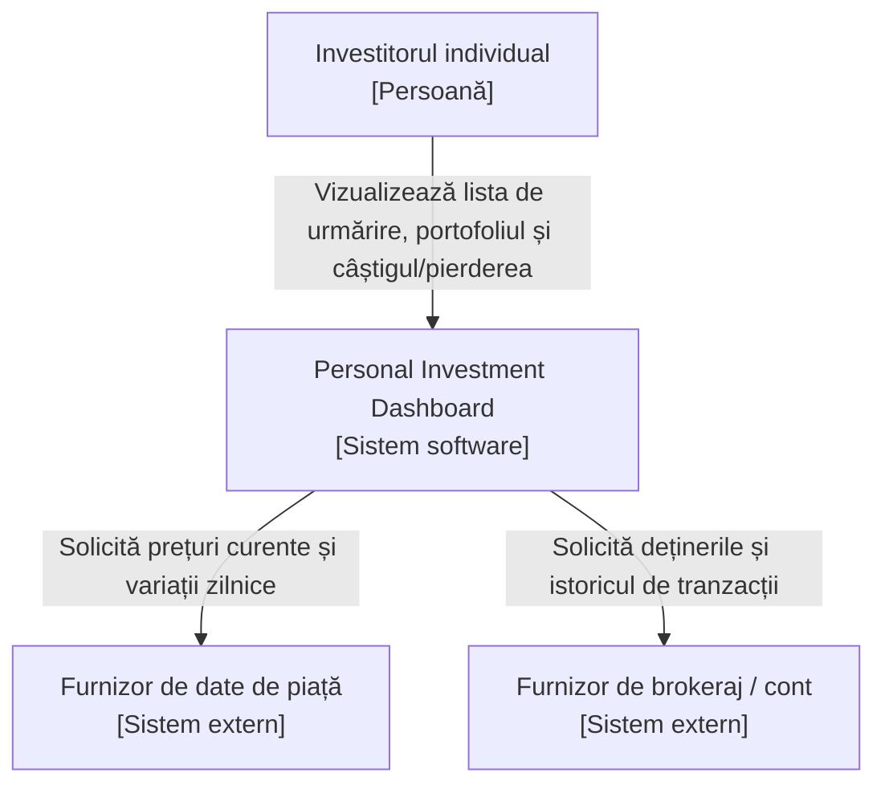

# Lab 1: Definirea Produsului Inițial — Personal Investment Dashboard

## 1. Cercetare de produs

**Întrebare:** Cum ajută produsele existente un User să urmărească informații de piață, și ce părți aparțin primei versiuni a acestui Dashboard?

Am analizat un produs de tip market-data (**Yahoo Finance**) și unul de tip trading (**Interactive Brokers**).

| Produs | Utilizator probabil și scop | Pattern reutilizabil |
|---|---|---|
| Yahoo Finance | Investitor ocazional care verifică prețuri și mișcarea pieței, fără să tranzacționeze. | Listă de urmărire (watchlist) cu preț live și variație zilnică (%). |
| Interactive Brokers | Investitor activ care deține poziții reale și vrea să vadă valoarea portofoliului și câștigul/pierderea. | Vedere de portofoliu: cantitate, cost mediu, valoare curentă, câștig/pierdere per deținere. |

**Concluzie de scop:** prima versiune trebuie să combine cele două — urmărirea prețurilor (ca Yahoo Finance) și performanța propriilor deținerilor (ca Interactive Brokers) — dar **fără** plasarea de tranzacții, care rămâne exclusiv domeniul unui produs de trading.

## 2. Stakeholderi și actori

| Stakeholder | Motivație | Influență | Motiv |
|---|---|---|---|
| Investitorul individual (User final) | Ridicată | Ridicată | Este singurul beneficiar direct; decizia lui de a folosi sau abandona produsul îi determină succesul. |
| Echipa de produs | Ridicată | Ridicată | Decide scopul, prioritățile și bugetul; controlează complet ce se construiește. |
| Furnizorul de date de piață | Scăzută | Ridicată | Nu are interes specific în acest produs, dar controlează unilateral disponibilitatea și costul datelor de care depinde întregul Dashboard. |
| Furnizorul de brokeraj/cont | Scăzută | Ridicată | Nu e interesat de acest produs anume, dar deține singura sursă reală a deținerilor Investitorului; fără acces la datele lui, Dashboard-ul nu poate funcționa. |
| Autoritatea de reglementare financiară | Scăzută | Ridicată | Nu vizează acest produs specific, dar poate impune reguli obligatorii (disclaimere, interzicerea sfaturilor automate de investiții) care schimbă scopul produsului indiferent de dorința echipei. |
| Echipa de suport pentru clienți | Ridicată | Scăzută | Are interes direct ca produsul să fie simplu de folosit, dar nu ia parte la deciziile de scop sau prioritizare. |

**Matricea Motivație / Influență**

| Motivație | Influență scăzută | Influență ridicată |
|---|---|---|
| **Ridicată** | Echipa de suport pentru clienți | Investitorul individual, Echipa de produs |
| **Scăzută** | — | Furnizorul de date de piață, Furnizorul de brokeraj/cont, Autoritatea de reglementare |

**Clasificare (stakeholder vs. actor vs. sistem extern):**

- **Actor uman direct:** Investitorul individual — se autentifică și folosește direct Dashboard-ul.
- **Sistem extern:** Furnizorul de date de piață — furnizează prețuri direct către Dashboard.
- **Sistem extern:** Furnizorul de brokeraj/cont — furnizează deținerile reale direct către Dashboard.
- **Doar stakeholder (nu apare în C4):** Echipa de produs, Autoritatea de reglementare, Echipa de suport — influențează produsul, dar nu interacționează direct cu sistemul.

## 3. Promisiunea produsului și scopul

> **Personal Investment Dashboard** ajută **investitorii individuali** să rezolve **urmărirea prețurilor de piață și a propriilor deținerilor din surse multiple, deconectate**, astfel încât **să vadă o imagine clară și actualizată a investițiilor lor și să ia decizii informate**.

**Cinci obiective:**

1. Un User vede prețul curent și variația zilnică a oricărui simbol urmărit.
2. Un User vede valoarea totală curentă a propriilor deținerilor.
3. Un User vede câștigul/pierderea per deținere de la achiziționare.
4. Un User este informat explicit când o valoare e învechită sau indisponibilă.
5. Un User adaugă un simbol nou în lista de urmărire în câteva secunde.

**Trei non-obiective:**

1. Plasarea, modificarea sau anularea de tranzacții.
2. Raportare fiscală sau documente fiscale oficiale.
3. Sfaturi de investiții personalizate sau recomandări automate.

## 4. Cerințe funcționale

Fiecare user story descrie mai întâi **scopul actorului** (ce vrea Investitorul să obțină), apoi **user story-ul** formal, apoi **definițiile de finalizare** care confirmă când cerința e îndeplinită.

### DASH-1 — Urmărire preț simbol

| | |
|---|---|
| **Scop actor** | Investitorul vrea să vadă cum evoluează azi un simbol care îl interesează. |
| **User story** | Ca Investitor, vreau să adaug un simbol în lista mea de urmărire și să văd prețul curent și variația zilnică, ca să pot verifica rapid cum evoluează. |
| **Definiții de finalizare** | • Simbolul apare cu preț curent și variație zilnică (%). • Dacă simbolul nu e găsit, apare un mesaj clar "nu a fost găsit". • Lista suportă minim 20 de simboluri. |

### DASH-2 — Valoare totală portofoliu

| | |
|---|---|
| **Scop actor** | Investitorul vrea să știe valoarea totală curentă a tot ce deține. |
| **User story** | Ca Investitor, vreau să văd valoarea totală curentă a deținerilor mele, ca să știu cum evoluează portofoliul chiar acum. |
| **Definiții de finalizare** | • Dashboard-ul afișează o valoare totală calculată din prețuri curente. • Dacă un preț lipsește, totalul e marcat vizibil ca "incomplet". • Totalul se actualizează la fiecare deschidere. |

### DASH-3 — Câștig/pierdere per deținere

| | |
|---|---|
| **Scop actor** | Investitorul vrea să știe dacă o deținere e pe plus sau pe minus. |
| **User story** | Ca Investitor, vreau să văd câștigul/pierderea fiecărei dețineri de la cumpărare, ca să decid dacă o păstrez. |
| **Definiții de finalizare** | • Fiecare deținere arată câștig/pierdere în sumă și procent. • Dacă lipsește costul de achiziție, apare "cost de bază indisponibil" în loc de o valoare falsă. • Câștigurile sunt distinse vizual clar de pierderi. |

### DASH-4 — Prospețimea datelor

| | |
|---|---|
| **Scop actor** | Investitorul vrea să aibă încredere că numerele afișate sunt actuale. |
| **User story** | Ca Investitor, vreau să fiu informat când datele sunt învechite sau lipsesc, ca să nu iau decizii pe baza unor informații depășite. |
| **Definiții de finalizare** | • Fiecare valoare arată ora ultimei actualizări. • Datele mai vechi decât limita stabilită sunt marcate explicit "învechit". • Dacă o sursă e inaccesibilă, apare o stare explicită "indisponibil". |

### DASH-5 — Gestionarea listei de urmărire

| | |
|---|---|
| **Scop actor** | Investitorul vrea să adauge sau să elimine un simbol din ce urmărește. |
| **User story** | Ca Investitor, vreau să caut și să adaug/elimin un simbol din lista mea, ca să văd doar ce e relevant pentru mine. |
| **Definiții de finalizare** | • Căutarea returnează rezultate în câteva secunde. • Adăugarea unui simbol deja existent nu creează duplicate. • Eliminarea unui simbol îl scoate imediat din listă. |

*(DASH-2 și DASH-4 acoperă cerința de minim două stories cu verificare pentru rezultat lipsă/învechit/nesuportat.)*

## 5. Vederea C4 System Context

**Note:**

- **Furnizorul de date de piață** — necesar pentru DASH-1 și DASH-4. Dacă un preț lipsește sau e învechit, Investitorul vede o marcare explicită, nu un număr greșit tacit.
- **Furnizorul de brokeraj/cont** — necesar pentru DASH-2 și DASH-3. Dacă accesul e revocat, Investitorul vede "deținerile sunt indisponibile — reconectați contul", nu o valoare inventată.

## Checklist

- [x] Am cercetat cel puțin două produse existente.
- [x] Am citat dovezi pentru fiecare pattern ales.
- [x] Cercetarea a confirmat o decizie de scop.
- [x] Am mapat motivația și influența stakeholderilor (binar High/Low).
- [x] Am separat stakeholderii, actorii și sistemele externe.
- [x] Promisiunea produsului e o singură propoziție.
- [x] Obiectivele/non-obiectivele corespund promisiunii.
- [x] Am scris cinci user stories.
- [x] Fiecare story are 2-4 definiții de finalizare.
- [x] Cel puțin două stories au un rezultat alternativ important.
- [x] Dependențele externe includ un rezultat lipsă/învechit/nesuportat.
- [x] Am creat vederea C4 System Context.
