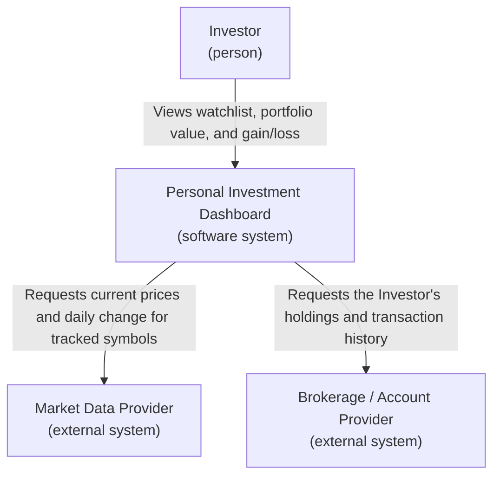

# Lab 1: Define the Initial Product — Personal Investment Dashboard

## 1. Product research

**Research question:** How do existing products help a User follow market information, and which parts belong in this Dashboard's first version?

I examined one market-data product (**Yahoo Finance**) and one trading product (**Interactive Brokers**).

| Product | Likely User and goal | Reusable pattern |
|---|---|---|
| Yahoo Finance | A casual investor who wants to check current prices, index movement, and news for stocks/funds they care about, without placing any trades. | A **watchlist** of chosen symbols showing live price, daily change (%), and a small price chart; grouped portfolio value if the user adds holdings manually. |
| Interactive Brokers | An active investor/trader who already owns positions and wants to see real portfolio value, gains/losses, and execute trades. | A **positions/portfolio view** showing quantity held, average cost, current value, and unrealized gain/loss per holding, plus account-level total balance. |

**How this shaped scope:** Yahoo Finance shows that a simple watchlist with price + daily change is the core "follow the market" experience and doesn't require an account. Interactive Brokers shows that investors also want to see *their own* holdings' performance (gain/loss, total value), not just raw market prices — but placing trades is a much bigger, separate concern. This confirmed the scope decision: **the first version should let a User track a watchlist and their own holdings' performance, but must not support placing trades** (that belongs to a trading product, not this Dashboard).

## 2. Stakeholders and actors

| Stakeholder | Motivation | Influence | Reason |
|---|---|---|---|
| Individual Investor (end User) | High | High | Uses the product daily to make personal financial decisions; if it doesn't serve them, the product fails. |
| Market Data Provider | Low | High | Doesn't care about this specific product, but the Dashboard depends entirely on it for prices; if it changes its API/terms, the Dashboard must adapt. |
| Brokerage/Account Provider | Low | High | Holds the real record of the User's holdings; the Dashboard is fully dependent on the accuracy and availability of this data. |
| Product Owner (the team building the Dashboard) | High | High | Directly decides scope, priorities, and what ships. |
| Financial Regulator | Low | Low (directly) | Doesn't interact with the Dashboard directly, but rules about displaying financial data / disclaimers could constrain the product. |
| Customer Support Team | Medium | Low | Wants the product to be simple enough to reduce support tickets, but doesn't control product decisions. |

**Motivation / Influence matrix**

| Motivation | Low influence | High influence |
|---|---|---|
| **High** | Customer Support Team | Individual Investor, Product Owner |
| **Low** | Financial Regulator | Market Data Provider, Brokerage/Account Provider |

**Classification (stakeholder vs. actor vs. external system):**

- **Direct human actor:** Individual Investor — logs in and directly uses the Dashboard.
- **External system:** Market Data Provider — supplies prices/quotes directly to the Dashboard.
- **External system:** Brokerage/Account Provider — supplies the User's real holdings/transactions directly to the Dashboard.
- **Stakeholder only (not in C4 view):** Product Owner, Financial Regulator, Customer Support Team — they influence or are affected by the product, but do not directly interact with the running system.

## 3. Product promise and scope

> **Personal Investment Dashboard** helps **individual retail investors** solve **the problem of tracking market prices and their own holdings across multiple, disconnected sources**, so that **they can see one clear, up-to-date picture of their investments and make informed decisions**.

**Five goals** (each a User-visible result):

1. A User can see the current price and daily change of any market symbol they choose to follow.
2. A User can see the total current value of their own holdings, updated with current market prices.
3. A User can see the gain or loss (in value and %) for each holding since it was acquired.
4. A User is clearly told when a price or holding value is outdated or unavailable, instead of seeing silently wrong numbers.
5. A User can find and add a new symbol to their watchlist within a few seconds.

**Three non-goals** (removed from the first version):

1. Placing, modifying, or cancelling trades of any kind.
2. Tax reporting or generating official tax documents.
3. Personalized investment advice or automated recommendations (e.g., "buy/sell" suggestions).

## 4. Functional requirements

### DASH-1
**Actor goal:** The Investor needs to see how a market symbol they care about is performing today.
**User story:** As an Investor, I want to add a symbol to my watchlist and see its current price and daily change, so that I can quickly check how it's doing.
**Definitions of done:**
- The symbol appears in the watchlist with a current price and a daily % change shown.
- If the symbol doesn't exist or can't be found, the Investor sees a clear "not found" message instead of a blank result.
- The watchlist supports at least 20 symbols per Investor.

### DASH-2
**Actor goal:** The Investor needs to know the total current value of everything they own.
**User story:** As an Investor, I want to see the total current value of my holdings, so that I know how my overall portfolio is doing right now.
**Definitions of done:**
- The Dashboard shows one total portfolio value, calculated from current prices.
- If one holding's current price is unavailable, the total is shown with a visible note that it's incomplete, rather than silently excluding it.
- The total updates whenever the Investor opens the Dashboard.

### DASH-3
**Actor goal:** The Investor needs to know if a specific holding is winning or losing money.
**User story:** As an Investor, I want to see the gain or loss for each holding since I bought it, so that I can decide whether to keep or review that investment.
**Definitions of done:**
- Each holding shows gain/loss in both currency amount and percentage.
- If the original purchase price is missing, the holding shows "cost basis unavailable" instead of a fake or zero gain/loss.
- Gains are visually distinguished from losses (e.g., clearly different presentation, not just color).

### DASH-4
**Actor goal:** The Investor needs to trust that the numbers they're seeing are current.
**User story:** As an Investor, I want to be told when displayed data is stale or missing, so that I don't make decisions based on outdated information.
**Definitions of done:**
- Each price or value shows the last-updated time.
- If data is older than a defined freshness limit, the Dashboard visibly flags it as "outdated" rather than presenting it as live.
- If a data source is completely unreachable, the affected section shows an explicit "unavailable" state, not an empty or misleading screen.

### DASH-5
**Actor goal:** The Investor needs to add or remove a symbol from what they're tracking.
**User story:** As an Investor, I want to search for and add a new symbol to my watchlist, or remove one I no longer care about, so that my Dashboard only shows what's relevant to me.
**Definitions of done:**
- A search returns matching symbols within a couple of seconds for a valid query.
- Adding an already-tracked symbol does not create a duplicate entry.
- Removing a symbol removes it immediately from the watchlist view.

*(Together, DASH-1 through DASH-5 cover: following market symbols, seeing total value, seeing per-holding performance, trusting data freshness, and managing the watchlist. DASH-2 and DASH-4 each include a check for missing/stale/unsupported results, satisfying the "at least two stories" requirement.)*

## 5. C4 System Context view

**Notes per external system:**

- **Market Data Provider** — needed for goals DASH-1 (watchlist prices) and DASH-4 (freshness). It supplies current price and daily change per symbol. If its result is missing or stale, the Investor sees an explicit "outdated"/"unavailable" flag on the affected symbol, never a silently wrong number.
- **Brokerage / Account Provider** — needed for goals DASH-2 and DASH-3 (portfolio value and gain/loss). It supplies the Investor's actual holdings, quantities, and original cost. If this result is missing or unauthorized (e.g., connection revoked), the Investor sees a clear "holdings unavailable — reconnect account" state instead of an empty or fabricated portfolio value.

The Dashboard owns turning these raw external results into one clear, trustworthy view for the Investor — it does not own or store the source-of-truth data itself.

---

## Checklist

- [x] I researched at least two existing products.
- [x] I cited evidence for each selected product pattern.
- [x] My research changed or confirmed at least one scope decision.
- [x] I mapped stakeholder motivation and influence.
- [x] I separated stakeholders, direct human actors, and external systems.
- [x] My product promise is one clear sentence.
- [x] My goals and non-goals agree with my product promise.
- [x] I wrote at least five user stories.
- [x] Every story has two to four definitions of done.
- [x] At least two stories include an important alternative result.
- [x] My external dependencies include a User-visible missing, stale, or unsupported result.
- [x] I created a C4 System Context view of the Dashboard.
